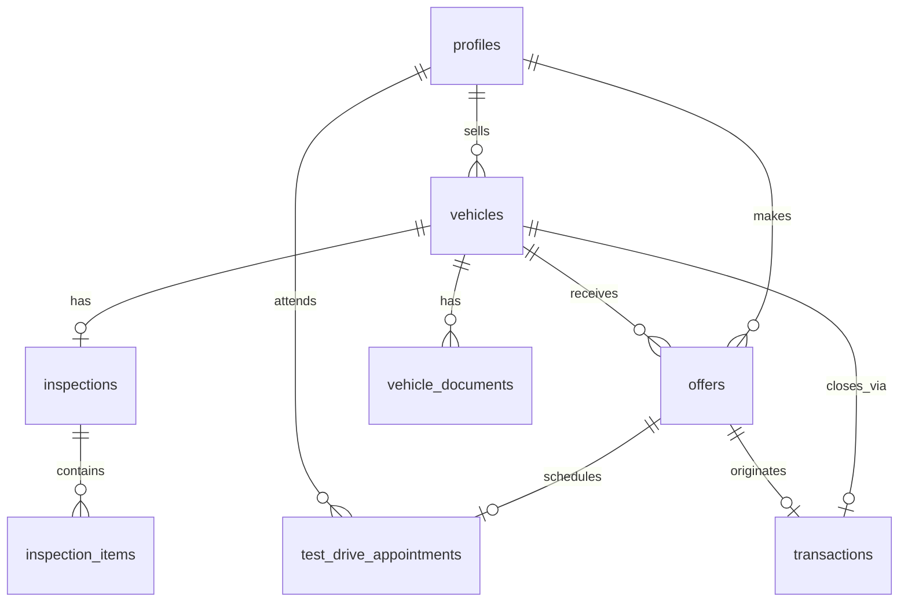

# Base de datos

> **Estado: migrado** — schema en `supabase/migrations/20250630120000_initial_schema.sql`  
> Tipos TS: `packages/shared/src/types/database.ts`

Texo usa Supabase Postgres con **RLS obligatorio** en todas las tablas del cliente.

---

## Migraciones aplicadas

| Fecha | Archivo | Descripción |
|-------|---------|-------------|
| 2025-06-30 | `initial_schema_core` + `initial_schema_rls_storage` (MCP Texo) | Enums, 8 tablas, RLS, triggers, buckets |

Aplicar local: `npx supabase db reset` · Remoto: ya aplicado vía MCP `user-supabase_texo` (2025-06-30)

---

## Tablas

| Tabla | Propósito | RLS |
|-------|-----------|-----|
| `profiles` | Extensión auth.users (rol, nombre, teléfono) | Own + admin |
| `vehicles` | Auto en flujo de venta | Public read si `published`; seller CRUD own |
| `vehicle_documents` | INE, factura (Storage refs) | Seller own + admin |
| `inspections` | Reporte inspección (score, certificación) | Published/seller read; seller/admin write |
| `inspection_items` | Daños/componentes por categoría | Via inspection visibility |
| `offers` | Ofertas formales comprador | Buyer CRUD own; seller read on own vehicles |
| `test_drive_appointments` | Citas prueba de manejo | Buyer CRUD; seller update confirm |
| `transactions` | Cierre documental (4 estados) | Parties + admin |

---

## Enums

### `user_role`
`seller` | `buyer` | `admin`

### `vehicle_status`
| Valor | Descripción |
|-------|-------------|
| `draft` | Captura inicial |
| `pending_documents` | Falta INE/factura |
| `pending_inspection` | Espera inspección |
| `inspection_failed` | Score < 75 |
| `published` | Visible en inventario |
| `offer_accepted` | Oferta aceptada |
| `sold` | Cierre documental/real |
| `withdrawn` | Retirado |

### `document_type`
`ine` | `invoice` | `circulation_card` | `other`

### `inspection_category`
`exterior` | `interior` | `mechanical` | `documentation` | `road_test`

### `offer_status`
`pending` | `accepted` | `rejected` | `countered` | `expired`

### `test_drive_status`
`scheduled` | `completed` | `cancelled` | `no_show`

### `transaction_status`
| Valor | Descripción |
|-------|-------------|
| `initiated` | Post-oferta aceptada |
| `confirmed` | Confirmación post-prueba |
| `closing` | En cierre (simulado demo) |
| `closed` | Operación cerrada |

---

## Relaciones (ER)



---

## Funciones helper (RLS)

| Función | Uso |
|---------|-----|
| `is_admin()` | Policies admin ALL |
| `is_vehicle_seller(uuid)` | Owner check vehículos/docs |
| `is_vehicle_published(uuid)` | Lectura inspección en inventario |

## Triggers

| Trigger | Efecto |
|---------|--------|
| `on_auth_user_created` | Crea `profiles` al signup (rol desde `user_metadata.role`) |
| `trg_vehicles_updated_at` | Actualiza `updated_at` |
| `trg_offers_updated_at` | Actualiza `updated_at` |

---

## RLS resumen

| Rol | Acceso |
|-----|--------|
| **Buyer** | SELECT vehicles `published`; CRUD own offers y citas |
| **Seller** | CRUD own vehicles/docs; SELECT offers on own vehicles; UPDATE citas confirm |
| **Admin** | ALL via `is_admin()` |

---

## Storage buckets

| Bucket | Público | Uso |
|--------|---------|-----|
| `vehicle-photos` | Sí | Fotos ficha |
| `transaction-documents` | No | INE, facturas |
| `inspection-reports` | No | PDF reporte mecánico |

Policies Storage: ver migración `20250705120000_security_and_business_rules.sql` (path `{vehicle_id}/...`, seller + admin).

| Policy | Bucket | Regla |
|--------|--------|-------|
| `vehicle_photos_public_read` | vehicle-photos | SELECT público |
| `vehicle_photos_seller_*` | vehicle-photos | INSERT/UPDATE/DELETE seller o admin |
| `transaction_docs_*` | transaction-documents | SELECT/INSERT/UPDATE/DELETE seller o admin |
| `inspection_reports_*` | inspection-reports | seller lectura/insert; admin ALL |

Triggers de negocio (misma migración): rol inmutable, solo admin publica/acepta ofertas, inspección solo admin.

---

## Tipos TypeScript

```bash
npx supabase gen types typescript --local > packages/shared/src/types/database.ts
```

Queries implementadas en `packages/shared/src/queries/` — ver `docs/contracts/api-surface.md`.

---

## Fuera de schema demo

`payments`, `escrow_accounts`, `signatures`, `notifications`, `kyc_verifications` — MVP productivo.
